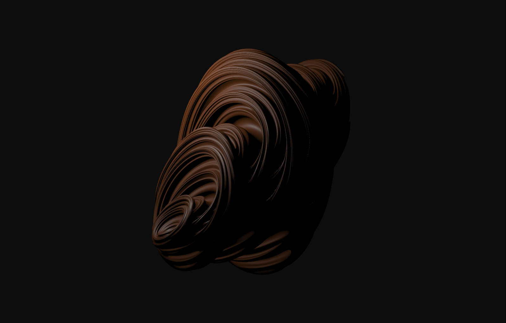
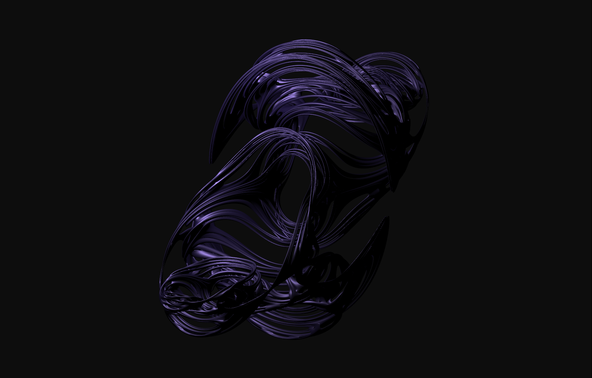
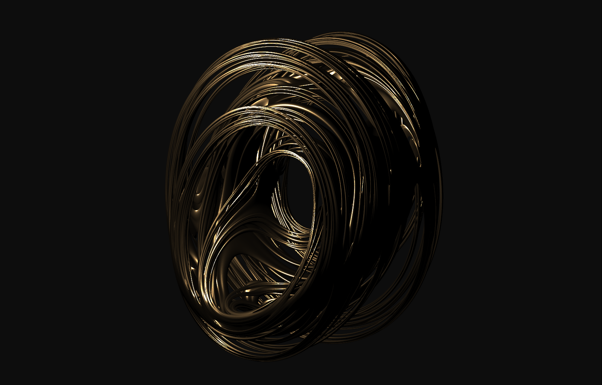

## Gallery

### Building the makefile

-   Run `premake5 gmake2` on the root directory to create the Makefile for the project.

### Running the makefile

-   Run `make` to build on Debug mode (macro `DEBUG` will be defined everywhere).
    -   When built in debug mode, the executable will run after building.
-   Run `make config=release` to build without `DEBUG` for deployment.
-   Either make command will create the object folder `obj/<CONFIG>` where all object files will be stored.

### Running the executable

-   The executable file is created in the `build/<CONFIG>` folder, where `CONFIG` is either `Debug`, or `Release`. `glfw3.dll` should be (and is by default) inside both these folders.
-   Run `./build/<CONFIG>/<PROJECTNAME>` to run either executable.

### Dependencies
- GLM
- GLFW
- GLEW
